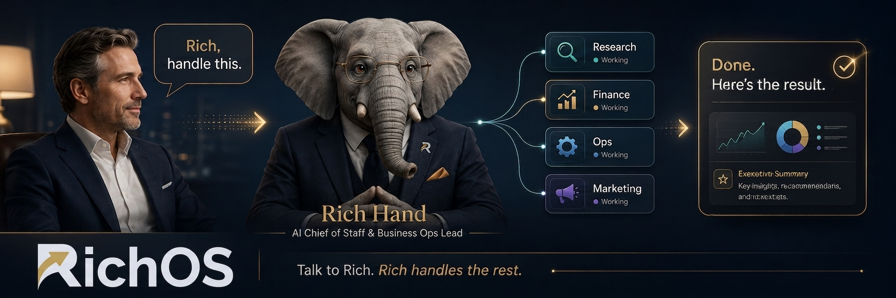

# RichOS: The Operating System for the AI-Enabled CEO

## Helping *non-technical CEOs* avoid falling behind

### RichOS gives you Rich. One AI executive who manages all your AI workers for you.

You **don't need** to understand AI agents, prompting, workflows or any of the technical stuff behind them.

You just talk to **Rich**.

> **Tell Rich what you want done. Rich handles the rest.**

Even if you are technical, RichOS might become your secret weapon. (You can switch the techy mode on and off.)

But if you're non-technical, you'll be glad that RichOS hides all that complexity by default.

Using RichOS is as easy as talking to a person.

---

