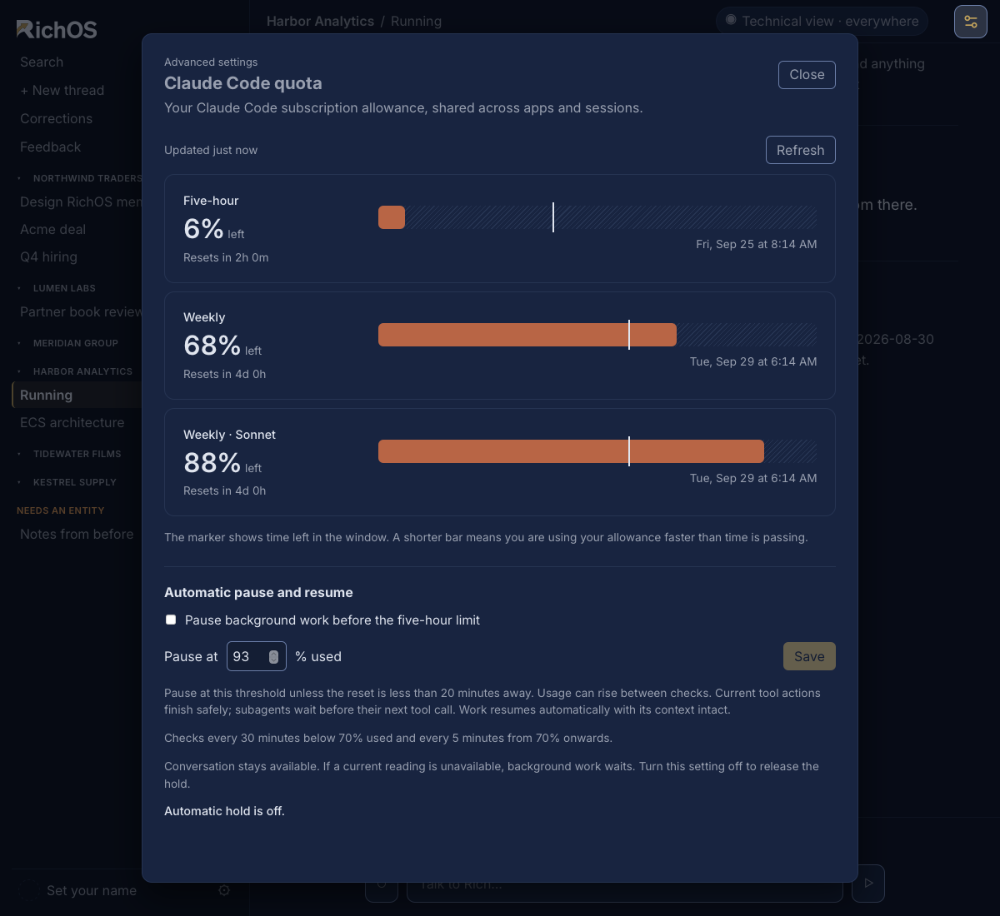
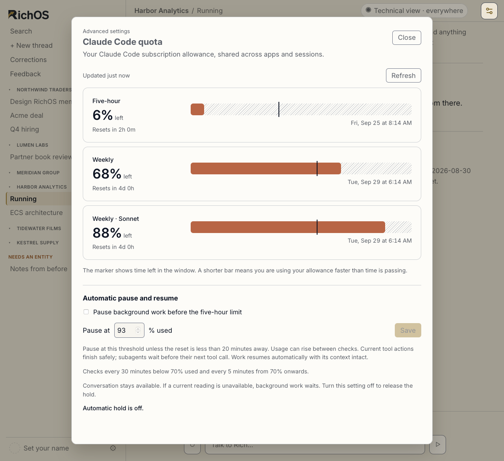

# Desktop Claude Code quota settings

Implemented on top of `5f0402d8c894a425ba946623c1de4e9c79581c0d` in the
`codex/claude-quota-settings` worktree. This is source verification, not a released
or installed desktop build.

## Behavior

Settings exposes Claude Code quota when Technical view is enabled. The panel
shows remaining subscription allowance, reset countdowns, a time marker, freshness
and manual refresh. Unknown readings never become zero usage or unlimited quota.
The desktop obtains the data through a reusable Claude Code `get_usage` control
connection with no user prompt, tools, MCP servers or session persistence.

Automatic holds are opt-in. The default threshold is 93% of the five-hour quota
used. A hold releases when reset is less than 20 minutes away. Exactly 20 minutes
still holds. Automatic reads run every 30 minutes below 70% used and every five
minutes from 70% upwards. The known reset time can bring the next read forward.
Failed reads back off for ten minutes; repeated manual clicks have a five-second
cooldown. Reads during account sign-in are suspended and account changes clear
cached windows and the control connection.

The work host waits before starting a background lease or issuing a continuation.
An app-owned PreToolUse wrapper also holds subagents before their next tool call.
It keeps the process and callback pending, then forwards the original callback to
the canonical engine hook for authorization and receipt checks. Running tools
finish. Usage can increase between polls and while a tool is running. There is no
attempt to cancel foreground conversation or control unrelated Claude sessions.

An enabled policy with unknown or expired five-hour data waits for a usable read.
Disabling the policy releases the hold. Stop and quit revoke the work normally.
The hook has a bounded wait of just under six hours and returns a blocking error
if monitoring remains unavailable for that entire period. It never fabricates a
new quota window or a successful completion.

## Checks run

From `richos/app`, with Cargo output directed to the external SSD:

```sh
cargo test -p richos-core --lib
cargo test -p richos-core --lib quota --quiet
cargo test -p richos-core --test engine_profile --quiet
cargo run -p richos-core --example claude_quota -- --live /path/to/claude
```

- Full core library run: 777 passed, one existing ignored test.
- Final targeted quota run: 14 passed, including the scheduler hold tests.
- Engine profile integration: 14 passed.
- `cargo check` from `richos/app/src-tauri`: passed with existing warnings.
- Installed Claude Code 2.1.282: the implemented reader returned three recognized
  windows with a fresh reading and no model request. The smoke tool reports only
  state and window count and deletes its temporary data.
- The built example's real hook entrypoint was exercised as a subprocess with
  fixture quota and scope files. It stayed pending at 94%, resumed when the fixture
  reset moved inside 20 minutes and forwarded the exact callback to a canonical
  hook fixture. Unit tests separately cover revocation, missing quota, disabled
  policy, protocol reuse, EOF, oversized output and interrupting a pending read.
- A full five-hour live subagent run was not performed. The hook behavior is
  tested with controlled state transitions; live provider verification covers the
  structured quota read.

From `richos/app/ui/tests`:

```sh
node quota.js
node settings-fit.js
node escape.js
```

Quota UI checks cover Technical view visibility, remaining percentages, policy
save/reopen/disable, stale and unavailable states, retry backoff, Escape, focus
return and both themes at 1024×700. The settings regression includes the new
disclosure row. The Escape suite discovers the quota sheet automatically.

## Screenshots

These are screenshots of the implemented renderer under WebKit using fixture
quota values, not live account usage. Layout checks run at 1024×700; the images
below use a taller viewport to show the controls and all three rows together.





The visual reference is [T3's desktop Limits view](https://github.com/pingdotgg/t3code/pull/10300).
The command-hook timeout behavior follows the
[Claude Code hooks reference](https://code.claude.com/docs/en/hooks).
